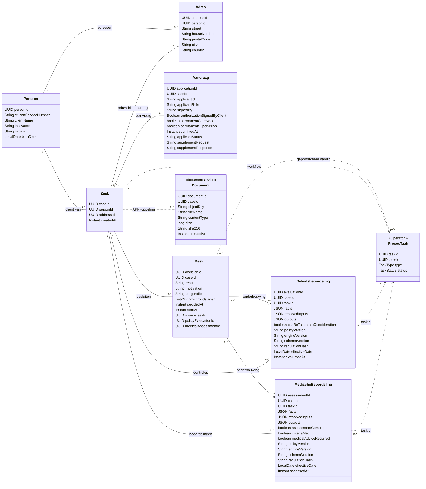

# Actueel klassendiagram van zaken

Gecontroleerd op 30 september 2026 aan de hand van de huidige Java-entiteiten. Nederlandse namen zijn weergavenamen; de opgeslagen velden staan met hun namen uit de code in het diagram. Technische outbox-records en enkele tijdstempels zijn voor de leesbaarheid weggelaten.

Een persoon kan meerdere zaken hebben. De zaak bevat alleen identificatie, verwijzingen en de aanmaaktijd. Elke nieuwe aanvraag krijgt een eigen adresrecord en een eigen zaak.

Een besluit is een afzonderlijk record. Nieuwe besluitvorming voegt een besluit toe; verzending markeert het nieuwste besluit. Zorgprofiel en grondslagen zijn eenvoudige tekstwaarden. Een besluit verwijst naar de laatste beschikbare beleids- en medische beoordeling op het moment van besluitvorming en naar de producerende taak. Deze beoordelingen behouden hun feiten, uitkomsten en regelversies; latere beoordelingen veranderen de verwijzingen van oudere besluiten niet.

Ten opzichte van het eerder aangeleverde wensdiagram zijn er deze concrete verschillen:

- Er is geen abstracte opgeslagen klasse `Beoordeling`; beleidsbeoordelingen en medische beoordelingen zijn afzonderlijke entiteiten met vergelijkbare herkomstvelden.
- Vertegenwoordiging en ondertekening staan als velden op `Aanvraag`; er is geen afzonderlijke `Vertegenwoordiging`-entiteit. De aanvrager is een `applicantId`, niet een aparte relatie naar een tweede `Persoon`.
- De voortgangsstatus staat op `Aanvraag` als `applicantStatus`. Operaton beheert de procesvolgorde en taken.
- Taken en documentmetadata zijn eigendom van andere diensten. De gestippelde relaties zijn verwijzingen via API's en identifiers, geen gedeelde database-relaties.

Bronnen: `case-service/src/main/java/nl/ciz/caseapi/*Entity.java`, `document-service/src/main/java/nl/ciz/document/DocumentEntity.java` en de frontend-transporttypen voor `CaseTask`.
